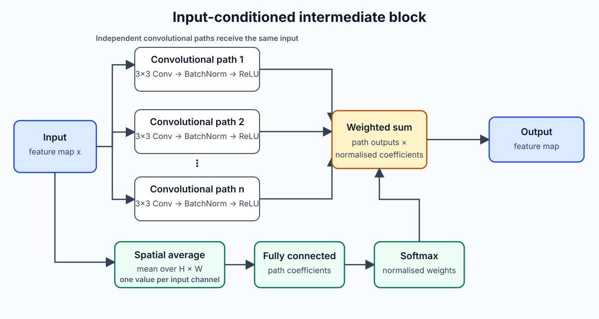
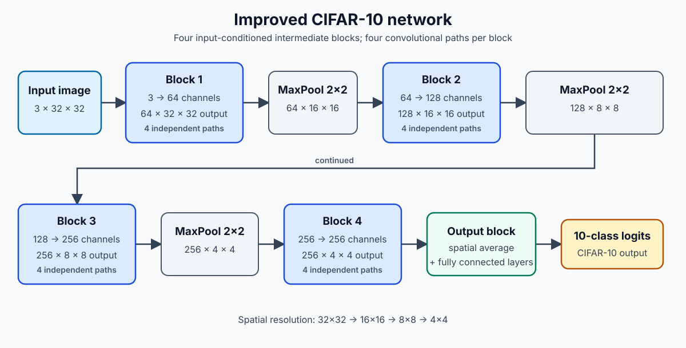
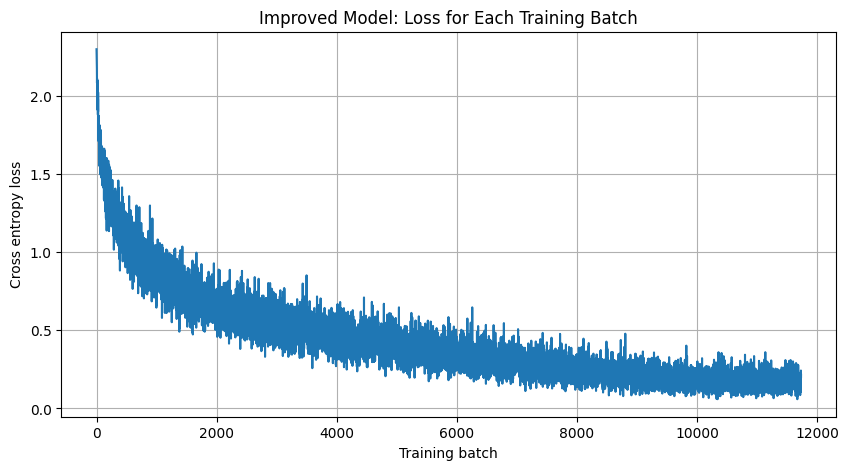
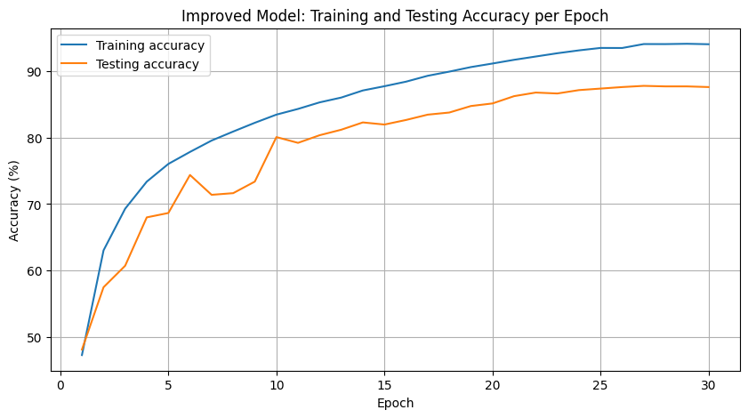
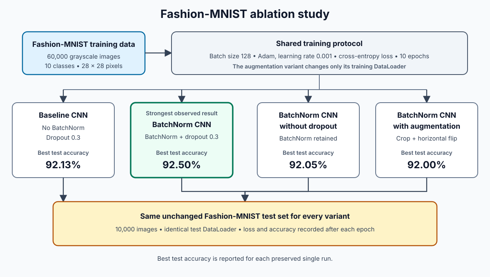
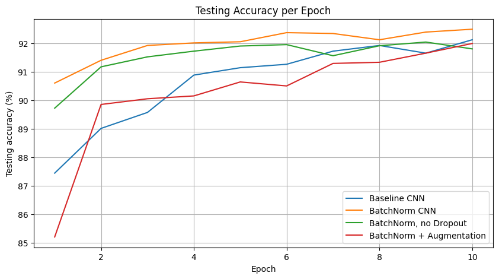

# Deep Learning for Image Classification

This repository contains two image-classification projects implemented with PyTorch:

- A custom CIFAR-10 convolutional architecture built from input-conditioned intermediate blocks.
- A Fashion-MNIST ablation study comparing batch normalization, dropout, and data augmentation.

The notebooks retain the recorded training histories, evaluation outputs, plots, and model comparisons used in the accompanying reports.

## Highlights

- Implemented a custom input-conditioned convolutional architecture.
- Improved CIFAR-10 best test accuracy from 84.76% to 87.81%.
- Conducted a controlled four-model Fashion-MNIST ablation study.
- The BatchNorm CNN achieved the strongest Fashion-MNIST result at 92.50%.

## Key results

| Experiment | Best test accuracy |
|---|---:|
| CIFAR-10 initial model | 84.76% |
| CIFAR-10 improved model | 87.81% |
| Fashion-MNIST baseline CNN | 92.13% |
| Fashion-MNIST BatchNorm CNN | 92.50% |
| Fashion-MNIST BatchNorm without dropout | 92.05% |
| Fashion-MNIST BatchNorm with augmentation | 92.00% |

## Project structure

```text
deep-learning-image-classification/
├── assets/
│   ├── diagrams/
│   ├── figures/
│   └── screenshots/
├── notebooks/
│   ├── part1_cifar10_image_classification.ipynb
│   └── part2_fashion_mnist_ablation.ipynb
├── reports/
│   ├── coursework-report.pdf
│   └── individual-reflection.pdf
├── README.md
├── requirements.txt
└── LICENSE
```

- `notebooks/` contains the complete CIFAR-10 and Fashion-MNIST experiments.
- `reports/` contains the project report and individual reflection.
- `assets/` provides tracked directories for figures, diagrams, and screenshots.
- `README.md` documents the repository and its results.
- `requirements.txt` lists the Python packages needed to run the notebooks.
- `LICENSE` contains the repository licence.

## Architecture

### Input-conditioned intermediate block



*The same input enters several independent convolutional paths. Channel-wise spatial averages pass through a fully connected layer and softmax to produce the coefficients used in the weighted sum.*

### Improved CIFAR-10 network



*The improved network uses four input-conditioned blocks. Max pooling after the first three blocks reduces the spatial resolution from 32×32 to 4×4 before the output block produces 10-class logits.*

## Part 1: CIFAR-10

The CIFAR-10 classifier uses a custom intermediate-block architecture. Within each block, several independent convolutional paths receive the same input feature map. The input is also averaged across its spatial dimensions to produce one value per channel. A fully connected layer transforms these channel averages into input-dependent path weights, and a softmax normalises the weights before the convolutional outputs are combined.

The improved model increases the network width and the number of convolutional paths while retaining the same input-conditioned combination mechanism. Training uses random cropping and horizontal flipping, cross-entropy loss, AdamW, weight decay, and cosine-annealing learning-rate scheduling. These changes increased the best recorded test accuracy from **84.76%** to **87.81%**.

See [the CIFAR-10 notebook](notebooks/part1_cifar10_image_classification.ipynb) for the architecture, training history, plots, and evaluation outputs.

## Training results

### Improved-model training loss



*Recorded cross-entropy loss for every training batch in the preserved 30-epoch run.*

### Improved-model training and test accuracy



*Recorded training and test accuracy across the improved model's 30 training epochs.*

The loss declines across training, while training accuracy rises above 94% and test accuracy peaks at 87.81% at epoch 27. The widening gap between the training and test curves is evidence of some overfitting, consistent with the report's interpretation.

## Part 2: Fashion-MNIST

The Fashion-MNIST experiment is a four-model ablation study:

1. A baseline CNN without batch normalization.
2. A CNN with batch normalization and dropout.
3. A BatchNorm CNN without dropout.
4. A BatchNorm CNN trained with random cropping and horizontal flipping.

All four variants use the same 10-epoch training budget. The BatchNorm CNN produced the strongest result at **92.50%**. Removing dropout increased the gap between training and test performance: the no-dropout model reached 98.82% training accuracy at epoch 10, while its best test accuracy was 92.05% and its final test accuracy was 91.81%. The augmented model reached 92.00% but did not outperform the standard BatchNorm model within 10 epochs.

See [the Fashion-MNIST notebook](notebooks/part2_fashion_mnist_ablation.ipynb) for the complete ablation results, training curves, and recorded timings.

### Ablation study visual



*The shared protocol branches into four controlled variants, each evaluated on the same unchanged Fashion-MNIST test set. The cards report the best test accuracy from each preserved run.*



*Recorded test-accuracy curves for the baseline, BatchNorm, no-dropout, and augmentation variants.*

The BatchNorm CNN produced the strongest best test accuracy at 92.50%. Removing dropout increased overfitting: training accuracy reached 98.82% at epoch 10, but final test accuracy fell to 91.81% after a best result of 92.05%. The augmented model reached 92.00% and did not outperform the standard BatchNorm CNN within the 10-epoch budget.

## Technologies

- Python
- PyTorch
- torchvision
- NumPy
- Matplotlib
- Jupyter Notebook
- Google Colab

## Running the project

### 1. Create and activate a virtual environment

From the repository root:

```bash
python3 -m venv .venv
source .venv/bin/activate
```

On Windows PowerShell, activate the environment with:

```powershell
.venv\Scripts\Activate.ps1
```

### 2. Install the dependencies

```bash
python -m pip install --upgrade pip
python -m pip install -r requirements.txt
```

### 3. Open the notebooks

```bash
jupyter notebook
```

Open either notebook from the `notebooks/` directory and run its cells in order. TorchVision downloads CIFAR-10 or Fashion-MNIST when the relevant dataset cell is run.

### Google Colab

Alternatively, upload either `.ipynb` file to Google Colab and run the cells in order. Each notebook automatically selects CUDA when it is available and otherwise uses the CPU.

## Limitations

- The CIFAR-10 test set was evaluated repeatedly during model development and used to identify the best epoch. A separate validation split would provide a cleaner basis for model selection.
- Each Fashion-MNIST variant was trained once, so the comparison may be affected by run-to-run variation.
- The results do not report means and standard deviations across repeated random seeds.
- The 10-epoch training budget may be too short for the augmented Fashion-MNIST model to benefit fully from the harder training transformations.

## Future work

- Introduce a validation split and reserve the test set for final evaluation.
- Repeat experiments across multiple seeds and report mean performance with standard deviation.
- Train the augmented Fashion-MNIST model for longer.
- Evaluate stronger regularisation and additional architecture variants while retaining the custom intermediate-block design in the CIFAR-10 experiment.

## Reports

- [Coursework report](reports/coursework-report.pdf)
- [Individual reflection](reports/individual-reflection.pdf)

## Author

**Aaron Gulzar**

MSc Data Science, Queen Mary University of London
